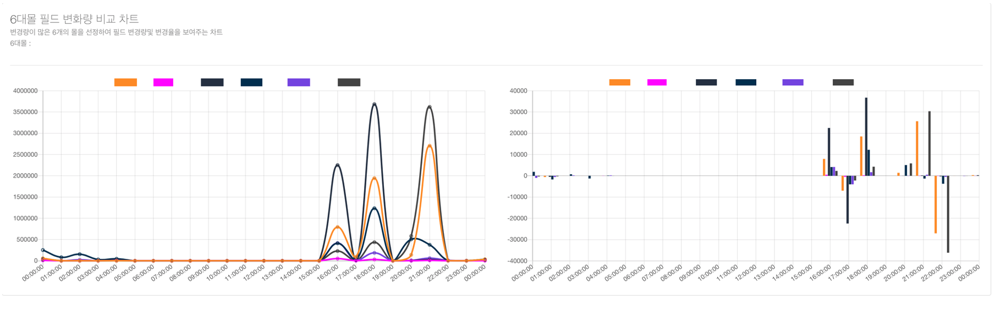

# 네이버 인턴

## 간단 소개

> **쇼핑 검색의 업체별 변경된 필드 데이터를 가지고 파이프라인 처리 및 시각화** ( 쇼핑 데이터에 대한 ETL 작업 및 BI Tool 제작 )

- ndqh1차 과제 : 변경 필드 데이터를 분석하여 시각화 제공
- 2차 과제 : Kibana에 다루기 힘든 기능이나 x-pack 유료 기능들을 제공하기 위해 Custom BI Tool 제작

  

## 프로젝트 기간

- 1차 : 2020.12.07 ~ 2021.01.22
- 2차 : 2020.01.23 ~ 2020.02.26

  

## 개발 환경 / 기술

### 1. Backend

* Java, JavaScript, kotlin
* Spring boot, Spring batch
* Spring Data JPA, QueryDSL
* Junit5, Mockito
* Gradle

### 2. Data Middleware

* ELK Stack
* kafka
* Apache Avro

### 3. Dev-Ops

* Airflow, Lambda
* PostgreSQL, MongoDB

### 4. Frontend

* HTML5, CSS3(SCSS), JS(ES6)
* React

  

## 1차 과제 - 변경 필드량 시각화

### 0. 전체 업무

> PostgreSQL에서 변경된 데이터들이 CDC 카프카에 들어오면 해당 토픽을 consume 해서 데이터 가공 및 시각화 제공

- CDC에 Avro 타입으로 Message가 저장되는데 그중 op 타입이 update인 경우에만 추출하여 데이터 가공
- Consumer 앱에 Elasticsearch 색인 모듈 구현
- Elasticsearch 인덱스 매핑 정보 및 샤드 개수, 레플리카 개수 등 설계
- Elasticsearch에 색인된 도큐먼트들을 Kibana로 시각화

 

### 1. 구조

* 상세 설명
  1. CDC 카프카에는 PostgreSQL에 변경된 데이터들이 토픽에 퍼블리싱되어 있음
  2. 퍼블리싱되어 있는 데이터들을 컨슘 하여 데이터를 추출
  3. 추출된 데이터를 Elasticsearch에 색인
  4. 색인된 도큐먼트들을 Kibana로 시각화

 

### 2. 내가 한 역할

1.  **Consumer 앱에서 추출된 데이터를 Elasticsearch에 색인하는 색인 모듈 구현**

   1. 모듈로 만든 이유는?
      * 현재는 2개의 토픽만 consume 하지만 추후 또 다른 토픽을 consume 해야 한다면 ***중복 코드가*** 발생할 거라 예상
      * 따라서 모듈을 만들어 의존성 주입만 해주면 편할 거라 판단

   1. 모듈을 어떻게 만들어야 할까?
      * 모듈은 ***범용성, 확장성, 간편성을*** 가지고 있어야 한다고 생각
      * 하지만 토픽별로 색인되어야 하는 매핑 정보가 스키마 리스하여 **일관적이지 않은** 구조를 지님
      * 따라서 제네릭과 가변인수를 사용하여 ***범용적으로 사용할 수 있게 구현***
      * 또한 ***추상화를*** 시켜 꼭 필요한 정보와 추가 정보를 담을 수 있도록 구현

2. **Elasticsearch 매핑 정보 설계**

   1. Elasticsearch 매핑 정보를 설정한 이유는?

      * Elasticsearch는 다른 NoSQL처럼 스키마 리스를 지원하기 때문에 매핑 정보를 설정 안 해도 되지만 설정을 안 하면 ***도큐먼트의 필드 타입이 text와 keyword 두 개가 생김***
      * 이는 누적되면 Elasticsearch에 부담이 생길 것으로 판단해 매핑 정보 정의

3. **Elasticsearch 샤드 개수, 레플리카 개수 설계 및 성능 검증**

   1. 설계를 어떻게 했고 왜 그렇게 했는지?

      * 인덱스를 하루 단위로 생성
      * 샤드 개수는 Elasticsearch ***공식 문서가 추천하는 샤드 사이즈***와 ***성능 검증***을 토대로 설정
      * 레플리카 개수는 fail-over 가능하도록 1개 설정
        * 1개 이상 만드는 것은 자원 낭비라 판단

   2. 성능 검증은 어떻게 했는지?

      * 샤드 5개랑 샤드 10개일 때, 직접 ***천만개*** 데이터를 Bulk 색인 시켜 테스트

      * 성능 검증 결과 - ***5개가 10개일 때보다 성능이 향상된 것을 보여 샤드 5개로 설정***

        

4. **Kibana로 시각화 작업 진행**

   1. 어떻게 시각화했는지?
      * Kibana의 Discover나 Dashboard를 사용하여 시각화 제공
   2. 부족한 시각화는 어떻게 해결했는지?
      * 추가로 표현하고 싶은 시각화 정보는 Timelion 같은 기능으로 구현

 

### 3. 최종결과

* 업체별 필드 상위 10개 변경량

  
  
* 그 외 다수 대시보드 존재 ( 보안상 기재 x )

 

### 4. 1차 과제의 문제점 및 아쉬웠던 점

* 1차 과제의 문제점 및 아쉬웠던 점

  1. ***데이터 유지 문제***

     

     * Elasticsearch의 기능인 ILM 주기가 3달이라 **데이터 유지 불가능** ( Historical한 데이터 집계 불가 ) -> Data Storage와 맞지 않음

  2. ***떨어지는 접근성***

     * 키바나 - 개발자에 특화되어 있는 도구
     * 따라서 개발자가 아닌 관리자들이 접근하기 힘듦
  
  3. ***키바나에서 제공하지 못하는 기능***
  
     
  
     * Alarm 서비스, 롤업 서비스 등 유료 기능 사용 x
  
  4. ***2차 가공이 힘든 키바나 데이터***
  
     * 키바나 내에서 2차 가공이 힘듦
     * 즉 키바나에서 보기 힘든 데이터를 가지고 있어 다른 사람에게 제공하기에 별 도움이 되지 않을거라 판단

> **따라서 위와 같은 문제점과 아쉬웠던 점을 개선하고파 2차 과제 진행**

  

## 2차 과제 - 사용자 맞춤화 BI Tool (Admin Service) 제작

### 0. 상세 업무

> 1차 과제의 문제점을 해결하고 아쉬웠던 점을 보완하기 위해 사용자 맞춤화 대시보드 서비스 기능 구현

- Kibana Rollup하여 필요한 집계 데이터 재색인 및 리소스 낭비 해결
- Elasticsearch 집계 모듈 구현
- 데이터를 2차 가공시키고 MongoDB에 저장시키는 Spring Batch Job 구현
- Airflow DAG를 구현해 Spring Batch Job 배포
- Mongo DB에 저장된 2차 데이터를 집계하여 React로 Custom BI Tool 구축

 

### 1. 구조

- 상세 설명

  1. Elasticsearch에 색인되어 있는 도큐먼트들을 Kibana Rollup Job을 사용해 원하는 집계 데이터 재색인

  2. 스프링 배치 잡을 사용하여 재색인 한 인덱스의 도큐먼트들을 가지고 와 데이터 가공

  3. 이때 아파치 Airflow로 cron 잡 진행 ( 1시간 단위로 진행 )

  4. 가공된 데이터를 몽고 DB에 저장
  5. Admin 애플리케이션을 만들어 몽고 DB에 저장된 데이터를 집계하여 React로 시각화 제공

 

### 2. 내가 한 역할

1. **Kibana Rollup Job 설정**

   1. Kibana Rollup Job을 한 이유?

      

      1. 필요한 집계 데이터를 빨리 가지고 오게 하기 위해 ***일종의 캐싱 역할을 한다고 생각***
      2. 또한 기존 인덱스는 짧은 생명주기로 인해 ***historical한 데이터를 가지고 오게 해야 한다면 문제가 발생***할 수 있음
      3. 필요한 데이터만 롤업 시켜기 때문에 ***리소스 관리에 효율적***이라 판단

   2. 인덱스 롤업한 결과

      

2. **Roll Up된 데이터를 집계 할수 있는 집계 모듈 구현 **

   1. 왜 구현했는지?
      * 엘라스틱 서치 집계 모듈이 구현되어 있지 않아 집계 모듈을 구현하면 좋을것 같다고 판단

   2. ***집계 모듈*** 만들 때 다 ***범용적으로 사용할 수 있도록*** 구현

3. **데이터 2차 가공을 하는 Spring Batch Job 구현**

   1. Spring Batch Job을 사용한 이유?
      * 마감 시간이 얼마 없어서 빠르게 구축하기 위해 사용해본 기술을 사용
      * 또한 프로젝트가 메인으로 이루어진 기술이 스프링이기 때문에 Spring Batch 기술을 사용
   2. 구현된 ***집계 모듈***을 사용해 Batch Job으로 ***데이터 2차 가공***
   3. 2차 가공 된 데이터는 몽고 DB에 저장

4. **Apache Airflow를 사용해 Spring Batch Job 실행하는 DAG 구축**

   1. Apache Airflow를 사용한 이유?

      * 제일 큰 이유는 팀에서 Airflow를 사용하는 추세여서 사용

      * DAG 기반이라 추후 다른 작업이 필요할 시 Airflow라면 쉽게 적용 가능하다고 판단

   2. Airflow DAG 구현 결과

      

5. **Mongo DB에 저장된 2차 데이터를 집계하여 React로 Custom BI Tool 구축 (Admin Service)**

   1. Custom BI Tool 설계 (Admin Service)

      1. 설계 구조

         

         1. 엘라스틱 서치에서 2차 가공된 데이터 집계 
         2. 몽고 DB에서 2차 강고된 데이터 집계 -> ***선택***

           1. 이유는?

              * ElasticSearch는 특성상 로그성 데이터에 잘 맞고 Mongo DB는 서비스에 잘 어울림

              * ***Custom BI Tool (Admin Service)는 관리자들을 위한 어플리케이션으로 제작하는 것이기 때문에 Mongo DB 사용***

              * 또한 컬렉션 구조만 같으면 재활용 가능

   2. Custom BI Tool (Admin Service) 성능 이슈 해결

      1. 초기 집계시 평균 4~9초 걸리는 이슈 발생 - Full Text Scan 문제

      2. 이를 해결하기 위해 Compound 인덱싱을 사용해서 해결 - ***(160배 속도 향상)***

      3. 직접 천만 개 데이터를 직접 넣어보고 테스트 진행한 결과 사진

         

   3. React와 차트 라이브러리를 사용해 시각화 기능 제공

     1. React와 차트 라이브러리 사용한 이유?
        1. 프런트 개발자가 아니기 때문에 래퍼런스가 많은 차트 라이브러리를 사용
        2. React도 팀 내에서 많이 사용하기 때문에 기술 채택
     2. 기본적인 문법을 통해 구현 ( props, fetch api 등 )

 

### 3. 최종결과

- 상위 5개 필드 변경량 ( 최대 변경량 상위 5개 )

  

- 검색한 업체의 평균 및 최대 필드 변경량

  

- 업체별 비교 차트 ( 업체 2개 선택해서 비교 가능 )

  

- 중요한 6개 업체 필드 변경량 차트

  

 

### 4. 2차 과제의 아쉬웠던 점 / 느낀 점

1. 2차 과제의 아쉬웠던 점
   * Elasticsearch에 의존을 많이 하다 보니 다른 플랫폼을 사용 못 해본게 아쉬움
   * 실제 환경에서 배포를 못 한 것이 아쉬움 ( 정책상 이유로 배포를 하지 못함 )
2. 2차 과제의 느낀 점
   * 데이터 엔지니어가 어떤 일을 하는지 알 수 있었음
     * 데이터 추출, 가공, 처리에 있어서 많은 것을 학습을 할 수 있었던 계기가 됌
   * 시스템 과점에서 다양한 안목을 가질 수 있었음
     * 일 1억 2천만 건의 데이터를 무리 없이 동작하게 구현함으로써 데이터 다루는 데 있어서 성장했다고 생각함
   * 협업을 통해 같이 성장하는 것을 느꼈고 멘토의 피드백을 통해 크게 성장했다고 느낌
