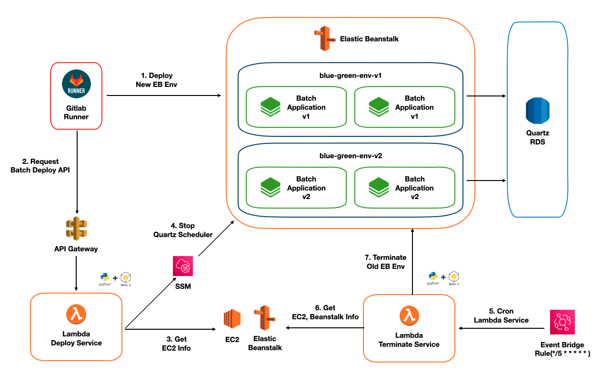

# 퍼플아이오

## 간단 소개

### 서비스 소개 : 코오롱몰

> **코오롱 자사 제품과 수탁업체 제품을 판매하는 이커머스 서비스**

- 주요 사용 대상
  - 코오롱 자사 제품과 수탁업체 제품을 구매하고 싶은 사용자
  - 가입자 수 : 4000K
  - MAU : 약 180K
  - [공식 홈페이지](https://www.kolonmall.com/)
- 주요 기능
  - 상품 판매 기능
  - 결제 시스템
  - 회원 관리 및 개인화
  - 장바구니 및 위시리스트
  - 주문 및 배송 관리
  - 프로모션 및 할인 이벤트
  - 리뷰 및 Q&A 시스템
  - CS(고객 서비스) 및 FAQ
  - 다국어 및 다중 통화 지원 등

 
 

### 주요 업무

> **코오롱몰 사이트 백엔드 개발, 운영 유지 보수, 로그 모니터링 및 대응, 대용량 데이터 관리 (ETL)**

- **Solr에서 Google Vertex AI 기반 검색 엔진으로 변경 및 REST 인터페이스 구현** 
  - 상품 기존 Solr 기반 검색 엔진을 Google Vertex AI 기반 검색 엔진으로 전환
  - 기간 : 2025.01 ~ 2025.04
  - 인원 : 3명
- **상품 메타 데이터 타서비스 이관 및 동기화** 
  - 상품 도메인을 다른 팀으로 이관하기 위해 데이터 마이그레이션 및 실시간 연동 기능 구현
  - 기간 : 2024.07 ~ 2024.12
  - 인원 : 2명
- **하이브리스 로그 - 통합 모니터링 시스템으로 변경**
  - EC2 기반의 하이브리드 백오피스 서버에서 로그 확인이 어려워 Fluent Bit을 연동하여 Grafana에 로그 적재 시스템을 구축
  - 기간 : 2024.08 ~ 2024.10
  - 인원 : 1명
- **회원 마케팅 데이터를 그루비 외부 API와 연동**
  - 회원 정보를 마케팅에 활용하기 위해 외부 솔루션에 데이터 연동 기능 구현
  - 기간 : 2024.01 ~ 2024.03
  - 인원 : 1명
- **AWS Beanstalk 환경 배치 시스템 무중단 배포 설계 및 구축**
  - Beanstalk 환경에서 배치 애플리케이션의 배치 잡이 중단되지 않는 무중단 배포 아키텍처 설계 및 구현
  - 기간 : 2023.07 ~ 2023.08
  - 인원 : 1명
- **케이크 [전기 바이크] 예약 플랫폼 구축**
  * 전기 바이크 브랜드 Cake의 시승 예약 서비스 구축 및 개발
  * 기간 : 2023.03 ~ 2023.06
  * 인원 : 2명

  

## 1. **Solr에서 Google Vertex AI 기반 검색 엔진으로 변경 및 REST 인터페이스 구현** 

### 1. 이슈 파악 / ToDo List

- 기존 Solr 기반 검색 엔진의 고도화 필요
- Google Vertex AI 검색 엔진으로 마이그레이션 작업 진행
- 검색 품질 및 성능 개선 요구

### 2. 내가 한 일

- **상세 설명**
  - 기존 Solr 기반 검색 엔진을 Google Vertex AI 기반 검색 엔진으로 전환하여 검색 품질 및 성능 개선
  - 프론트엔드에서 전송된 검색 요청을 Google Vertex AI 형식에 맞게 변환하는 백엔드 인터페이스 개발
  - 데이터 팀이 모델링한 알고리즘 기반으로 검색 결과를 받아 프론트엔드에 전달하는 중간 계층 구현

- **구현 방법 및 고민 사항**
  - **검색 정보 문서화 및 모델링**
    - **문제** : 기존 Solr 필드와 Vertex AI 요구 필드 간 구조적 차이
    - **해결** : 필드 간 매핑 정보 정리 및 문서화를 통한 체계적 마이그레이션 진행
    - **고민** : 레거시 필드 정리 및 데이터 타입/형식 개선 -> 검색 정확도 향상을 위한 최적화 모델링 수행
  - **Google API 연동**
    - **문제** : 하이브리스 버전 제약으로 Google SDK 직접 사용 불가
    - **해결** : RestTemplate을 활용한 커스텀 REST API 클라이언트 개발
    - **고민** : Vertex AI의 Query Language 기반 Http Spec 생성 방식 설계
  - **Google 인증 클라이언트 구현**
    - **문제** : 기존 시스템에 OAuth2 인증 메커니즘 부재
    - **해결** : OAuth2 프로토콜 기반 인증 로직 직접 구현(JWT 기반 토큰 생성 및 검증)
    - **고민** : 인증 요청 최적화 -> Redis에 토큰 캐싱 후 1시간 주기로 갱신하는 구조로 설계하여 API 호출 횟수 감소
  - **검색 응답 처리**
    - **문제** : Vertex AI의 응답 형식과 기존 Solr 응답 구조 간 차이
    - **해결** : 응답 데이터 매핑 레이어 구현으로 기존 프론트엔드 호환성 유지
    - **고민** : 검색 결과의 일관성 보장 -> 기존 Solr 응답과 비교 테스트 진행하며 데이터 정합성 확보
  - **성능 최적화**
    - **문제** : 검색 요청 증가 시 API 부하 및 응답 지연 가능성
    - **해결** : 효율적인 API 호출 구조 설계 및 응답 데이터 경량화
    - **고민** : 향후 인기 검색어에 대한 결과 캐싱 도입 검토 -> 응답 속도 개선 및 API 호출 비용 절감 가능성 제시
- **결과**
  - Google Vertex AI 검색 엔진으로 성공적 마이그레이션 완료
  - 검색 정확도 향상 및 사용자 만족도 증가
  - RestTemplate 기반 커스텀 API 클라이언트로 시스템 제약 극복
  - OAuth2 인증 및 Redis 토큰 캐싱으로 API 호출 최적화
  - 검색 필드 재모델링을 통한 검색 품질 개선
  - 검색 엔진 고도화로 서비스 경쟁력 강화

 
 

## 2. **상품 메타 데이터 타서비스 이관 및 동기화** 

### 1. 이슈 파악 / ToDo List

- 방대한 하이브리스 생태계로 인해 도메인 분리가 필요
- **상품 도메인 타팀으로 이관 작업** 수행

### 2. 내가 한 일

- **상세 설명**
  - 상품 업데이트 타입을 활용해 API 요청을 통한 상품 업데이트 기능 구현

- **구현 방법 및 고민 사항**
  - **대량건 색인**
    - **문제** : 데이터 1만 건 기준, 단건 + 멀티스레드 처리 시 평균 57분 소요
    - **해결** : Queue와 Lambda를 사용하여 데이터를 최대 100건씩 롤업 후 API 요청 진행
      - 결과: 1만 건 기준 24분으로 소요 시간 단축
    - **고민** : Queue에 담을 수 있는 메시지 크기와 Bulk 색인 건수 최적화 -> 여러 번 테스트 후 최적의 건수 채택
  - **데이터 동기화 / 순서 보장**
    - **문제** : 데이터의 정합성과 무결성 확보를 위해 순서 보장이 필요
    - **해결** : 타팀 서버에서 최신 데이터를 가져오는 API 요청을 통해 데이터 최신화
    - **고민** : 네트워크 비용 최적화 -> 요청 타입별로 데이터를 그룹핑하여 효율적으로 요청
  - **실패 처리**
    - **문제** : 업데이트 실패한 데이터에 대한 재처리 과정 필요
    - **해결** : 실패 데이터를 별도 태이블에 저장 후 배치 스케쥴러 사용
    - **고민** : 재처리 하는 과정에서 실패하는 경우 -> 사내 메신저 알람 전송으로 즉각 인지 및 대응 가능하게 구현
  - **데이터 누락 방지**
    - **문제**: 큐에 잘못된 레코드가 들어와 Lambda에서 데이터 파싱 오류 발생
    - **해결**: 이상이 있는 데이터에 대해 따로 Redis에 저장 후 사내 메신저 알람 발송
    - **고민**: 오류 데이터를 자동화할 수 있는지 고민했지만 방안이 떠오르지 않아 알람 전송 방식 채택
  - **트랜잭션 관리 및 성능 튜닝**
    - **문제**: 하이브리스가 제공하는 ORM을 사용하면 단건마다 트랜잭션을 사용하기 때문에 속도 이슈 발생
    - **해결**: 트랜잭션을 직접 열고 닫아 트랜잭션 남용 방지 및 성능 최적화
    - **고민**: 중간에 롤백이 발생하면 처리된 데이터와 원본 데이터 복구 방안 검토 -> 최대한 비즈니스 로직 내에서 트랜잭션을 걸지 않고 마지막에 트랜잭션 처리하여 위험성 최소화
- **결과**
  - 상품 업데이트 실행 시 1만 건 기준 24분 소요
  - 실시간 데이터 처리 및 동기화 완료
  - Failover 가능한 시스템 구축
  - 누락된 데이터 인지 및 즉각 대응
  - 트랜잭션 직접 관리로 성능 대폭 향상

 
 

## 3. 하이브리스 로그 - 통합 모니터링 시스템으로 변경

### 1. 이슈 파악 / ToDo List

- EC2 기반의 어드민 서버 로그 확인시 Bastion 서버에 접속 후 로그를 확인해야 하기 때문에 짧은 세션 시간으로 인해 로그 확인이 어렵고 불편한 문제 발생
- **Fluent Bit**을 연동하여 기존에 사용 중인 **통합 모니터링 시스템**에 로그를 적재

### 2. 내가 한 일

- **상세 설명**

  - 하이브리스 로그를 Fluent Bit을 활용해 통합 모니터링 시스템 (Loki + Prometheus + Grafana)에 적재

- **구현 방법 및 고민 사항**

  - **기술 채택 (Fluentd vs Fluent Bit)**
    - **문제** : 어떤 플랫폼을 사용해야 리소스를 효율적으로 사용할지 고민
    - **해결** : Fluent Bit을 채택하여 적은 메모리 사용과 빌드 툴등 의존도 없이 간단한 설정으로 적용시킬 수 있기 때문에 Fluent Bit으로 해결
  - **도커 환경에서 Fluent Bit 적용**
    - **문제** : 각각의 컨테이너로 구성된 애플리케이션 로그를 어떻게 수집해 Loki에 전송할지 고민
    - **해결** : EC2 내에 Fluent Bit 이미지를 실행하고 Volume 공유된 로그 파일을 읽어 통합 모니터링 시스템에 적재
    - **고민** : e.printStackTrace() 등 출력 형식이 다른 로그도 있어 Fleunt bit에서 파싱 할 때 형식이 맞지 않아 로그가 분리되는 이슈 발생 ->Fluent Bit의 필터에서 Lua 스크립트를 사용해 분리되는 로그를 가공

- **결과**

  - Bastion 서버의 세션 끊김 문제 해결로 로그 확인이 용이해짐

  - 통합 로그 시스템에 어드민 서버 로그를 적재하여 관리 효율성 개선

  - 아키텍처

    

  - 로그 적재 화면

  

  

## 4. 회원 마케팅 데이터를 그루비 외부 API와 연동

### 1. 이슈 파악 / ToDo List

- 회원 마케팅 데이터를 활용해야 하는 니즈가 발생
- 회원 데이터를 외부 API와 연동하는 기능 구현

### 2. 내가 한일

- **상세 설명**
  - 대규모 회원 데이터를 무리 없이 연동할 수 있도록 기능 구현
- **구현 방법 및 고민 사항**
  - **서버 내에서 외부 솔루션 연동이 아닌 AWS 서비스를 이용하여 연동**
    - **문제** : 서버에서 외부 솔루션 API에 직접 요청 시 네트워크 비용이 증가하고 처리 시간이 길어져 서버의 쓰레드 점유 등 여러 문제가 발생
    - **해결** : SQS + Lambda를 활용하여 서버의 의존도를 분리 -> 서버 내 로직 수행 시간 감소 및 쓰레드 점유율 감소 등 퍼포먼스를 향상
  - **Serverless 프레임워크를 사용한 Lambda 함수 구현**
    - 형상 관리를 위해 Serverless 프레임워크로 Lambda 함수 구현
    - Serverless config 파일을 통해 서비스 연동(ARN) 및 Lambda 환경 설정(Concurrency 설정, 환경 변수 등)
    - 스테이지와 운영 환경에 맞게 관리
  - **실패한 데이터 재처리를 위한 배치 스케줄러 구현**
    - **문제** : 실패한 데이터를 Failover 할 수 있게 무언가가 필요하다고 판단
    - **해결** : 실패한 데이터를 별도의 테이블에 저장하고, 배치 스케줄러를 통해 실패 건을 가져와 그루비 외부 API에 재요청 하도록 구현

- **결과**
  - TPS 400 환경에서도 무리 없이 동작

  

## 5. AWS Beanstalk 환경 배치 시스템 무중단 배포 설계 및 구축

### 1. 이슈 파악 / ToDo List

- AWS Beanstalk 환경에서 배치 작업 배포 시 작업이 중단되는 구조적 문제 발생
- 배치 시스템 무중단 배포를 구현하는 설계 및 테스트 케이스 구현

### 2. 내가 한일

- **상세 설명**

  - AWS Beanstalk 환경에서 배치 어플리케이션 무중단 배포 설계 및 구현

- **구현 방법 및 고민 사항**

  - **배치 어플리케이션 Graceful 종료 설정**

    - **방법** 
      - 동작 중인 Job의 Thread를 즉시 종료하지 않고, 처리 중인 작업을 완료한 후 종료하도록 설정
      - Quartz Job 내부 interrupt() 함수로 close 로직 구현
      - 인프라에 대한 추가 지식 없이도 배포 전략 없이 간단하게 구현할 수 있어 Graceful Shutdown 방식을 채택

  - **람다를 사용하여 Beanstalk 컨테이터 blue/green 배포 전략으로 설계**

    - **방법** 

      - Beanstalk는 새로운 버전을 배포하면 AWS가 자동으로 이전 버전을 종료시키기 때문에 제어 가능한 매개체가 필요하다고 판단

      - Lambda + SSM + Shell Script + Event Bridge + API를 조합하여 Beanstalk의 Shutdown을 통제하도록 설계

      - 아키텍처

        

        * 설명
          * EB 명령어로 New 버전 Deploy 실행
          * Deploy Lambda에게 Deploy API 요청
          * Lambda 내부에서 Old 버전의 Scheduler Shutdown API 요청
          * Terminate Lambda는 Event Bridge를 사용해서 5분마다 이전 버전에서 Job이 종료 됐는지 Check
          * Job 종료가 감지되면 Lambda에서 EB를 직접 종료

- **결과**

  - 새로운 어플리케이션의 업타임과 기존 어플리케이션의 다운타임 사이에 데이터 손실을 방지
  - Beanstalk 종료 시 AWS의 기본 동작에 구애받지 않고 Shutdown을 통제할 수 있어 배치 작업을 완벽히 종료한 후 배포 가능

  

## 6. 케이크 [전기 바이크] 예약 플랫폼 구축

### 1. 이슈 파악 / ToDo List

- 전기 바이크 예약 플랫폼인 케이크 서비스 구축

### 2. 내가 한일

- **상세 설명**

  - 전기 바이크 예약 플랫폼의 백엔드 API 개발 전반을 담당
- **담당 업무**
  - **회원 관련 API 구현**
    - SNS 로그인 API 설계 및 구현
    - Spring Security를 활용하여 관리자 권한 설정 및 인증/인가 로직 구현
  - **프로젝트 구조 변경**
    - 기존 모놀리식 + 멀티 레포지토리 구조를 멀티 모듈 + 단일 레포지토리 구조로 전환 -> 중복 설정 및 코드 정리로 유지 보수성과 개발 효율성 향상
  - **문서 자동화**
    - Swagger를 적용하여 API 문서화를 자동화 -> 프론트엔드 개발자가 API 명세를 즉시 확인 가능하도록 지원하여 생산성 향상
  - **Argo CD 알림 기능 추가**
    - Pod 상태를 지속적으로 모니터링할 수 있는 알림 기능 구축 -> 실시간 Pod 상태 파악으로 장애 발생 시 즉각 대응 가능하도록 개선
