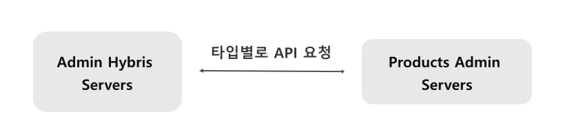
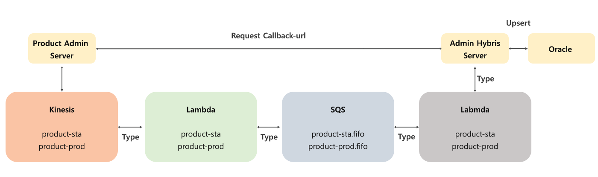
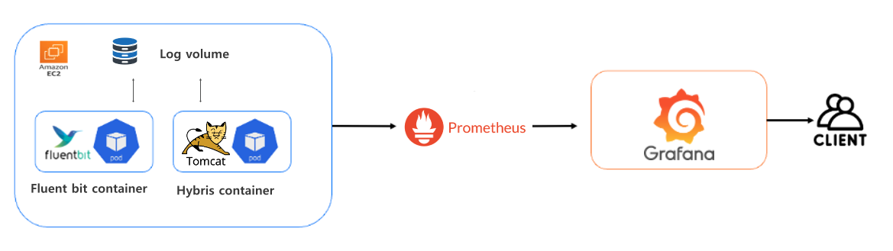
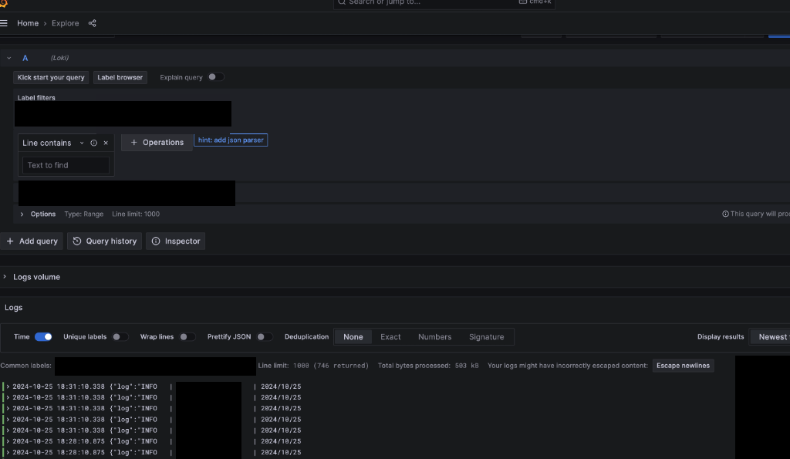
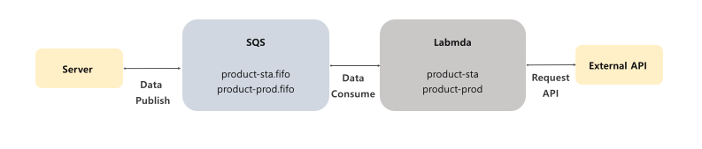

# 퍼플아이오

## 간단 소개

### 서비스 소개 : 코오롱몰

> **코오롱 자사 제품과 수탁업체 제품을 판매하는 이커머스 서비스**

- 주요 사용 대상
  - 코오롱 자사 제품과 수탁업체 제품을 구매하고 싶은 사용자
  - 가입자 수 : 4000K
  - MAU : 약 180K
  - [공식 홈페이지](https://www.kolonmall.com/)
- 주요 기능
  - 상품 판매 기능
  - 결제 시스템
  - 회원 관리 및 개인화
  - 장바구니 및 위시리스트
  - 주문 및 배송 관리
  - 프로모션 및 할인 이벤트
  - 리뷰 및 Q&A 시스템
  - CS(고객 서비스) 및 FAQ
  - 다국어 및 다중 통화 지원 등

 

### 주요 업무

> **코오롱몰 사이트 백엔드 개발, 운영 유지 보수, 로그 모니터링 및 대응, 대용량 데이터 관리 (ETL)**

- **상품 메타 데이터 타서비스 이관 및 동기화** 
  - 상품 도메인을 다른 팀으로 이관하기 위해 데이터 마이그레이션 및 실시간 연동 기능 구현
  - 기간 : 2024.07 ~ 2024.11
  - 인원 : 2명
- **하이브리스 로그 - 통합 모니터링 시스템으로 변경**
  - EC2 기반의 하이브리드 백오피스 서버에서 로그 확인이 어려워 Fluent Bit을 연동하여 Grafana에 로그 적재 시스템을 구축
  - 기간 : 2024.08 ~ 2024.10
  - 인원 : 1명
- **회원 마케팅 데이터를 그루비 외부 API와 연동**
  - 회원 정보를 마케팅에 활용하기 위해 외부 솔루션에 데이터 연동 기능 구현
  - 기간 : 2024.01 ~ 2024.03
  - 인원 : 1명

  

## 1. **상품 메타 데이터 타서비스 이관 및 동기화** 

### 1. 이슈 파악 / ToDo List

- 방대한 하이브리스 생태계로 인해 도메인 분리가 필요 -> ***상품 도메인 타팀으로 이관 작업***

 

### 2. 내가 한 일

#### 1. 상품 도메인 타팀으로 이관 작업

- ToDo List

  > 1. 상품 타입 별 메타 데이터 업데이트 api 구현
  > 2. 실시간 대용량 데이터 동기화 파이프라인 구조 설계
  
- 상세 설명

  1. ***상품 타입 별 메타 데이터 업데이트 api 구현***

     - 상품 업데이트 타입을 통해 api 요청으로 상품 업데이트 기능 구현
  
     - api 요청 이유?
  
       - 하이브리스라는 특수 환경을 사용하기 때문에 이벤트 기반 아키텍처를 진행할 수 없어 api로 요청으로 설계
  
       - 최소한의 api 요청과 트랜잭션 관리로 성능 튜닝
  
     - 아키텍처
  
       
  
       * 요청시 상품 코드를 그루핑해서 요청 -> 단건 요청이 아닌 벌크 형태로 요청함으로써 커넥션 시간 감소
       * 최소한의 트랜잭션으로 프로세스 시간 단축
  
  2. ***실시간 대용량 데이터 동기화 파이프라인 구조 설계***
  
     - 누락 없는 실시간 대용량 데이터 동기화 필요
  
     - 설계 중점
  
       - 5분 기준 10000건 데이터 성능 이슈 없이 업데이트
       - 누락건 없이 모든 상품 데이터 업데이트
       - 순서 보장
  
     - 아키텍처
  
       
  
       - 1번째 람다에서 키네시스 데이터 Latest로 컨슘 후 SQS에 저장
         - 하이브리스 서버로 바로 쏘지 않는 이유?
           - 레코드를 벌크형태로 롤업해서 보내기 위해
           - 다른 메타데이터들의 이관 확장성을 고려해 1번째 람다에서 1차 가공
       - SQS를 fifo로 두어 상품 업데이트 순서 보장과 2차 람다에서 메시지 한번 더 말아서 2차 가공
  
     - 결과
  
       - 단 한건의 데이터 누락 없이 업데이트 데이터 5000건 기준 17분 소요

 
 

## 2. 하이브리스 로그 - 통합 모니터링 시스템으로 변경

### 1. 이슈 파악 / ToDo List

- EC2 기반의 하이브리드 백오피스 서버에서 로그 확인이 어려워 Fluent Bit을 연동하여 Grafana에 로그 적재 시스템을 구축 -> ***통합 모니터링 시스템으로 변경***

 

### 2. 내가 한 일

#### 1. 통합 모니터링 시스템으로 변경

- ToDo List

> 1. fluent bit 기술 서칭 및 로그 형태 분석, 데이터 포멧 및 적재 방식 설계

- 상세 설명

  1. ***fluent bit 기술 서칭 및 로그 형태 분석, 데이터 포멧 및 적재 방식 설계***

     - Fluentd가 아닌 Fluent bit 사용 이유?
  
       - 메모리 요구사항이 적고, 높은 퍼포먼스를 나타냄
       - 다른 빌드 툴의 의존성이 필요 없음 -> 간단한 설정으로 사용 가능
  
     - 아키텍처
  
       
  
       * 볼륨으로 컨테이너끼리 로그 공유
       * Fluent bit 로그 파싱 후 필터에 로그 가공 후 프로메테우스에 적재
       * 그라파나로 시각화
  
     - 결과
  
       

  

## 3. 회원 마케팅 데이터를 그루비 외부 API와 연동

### 1. 이슈 파악 / ToDo List

- 회원 마케팅 데이터 활용 니즈가 있어 외부 솔루션과 연동 -> ***회원 데이터 외부 API 연동 작업 진행***

 

### 2. 내가 한일

#### 1. 회원 데이터 외부 API 연동 작업 진행

- ToDo List

  > 1. 대규모 회원 데이터를 무리 없이 연동 할 수 있게 구조 설계

- 상세 설명

  1. ***대규모 회원 데이터를 무리 없이 연동 할 수 있게 구조 설계***

     - TPS 400 규모의 상황에서 무리없이 연동 가능하도록 SQS + Lambda를 이용해 기능 구현

     - 람다 n개의 Concurrency를 설정 및 50초의 타임아웃을 걸어 레이턴시를 늦춤
     
     - 지속적인 알람 메시지를 보내지 않기 위해 람다 공유 변수를 두어 에러 카운트를 체크 (최대 10번)
     
     - FailOver 할 수 있도록 배치 잡 생성 및 실행 기능 구현
     
     - 아키텍처
     
          
     
   - 결과
     
        - TPS 400 정도의 환경을 무리없이 동작
     

  

