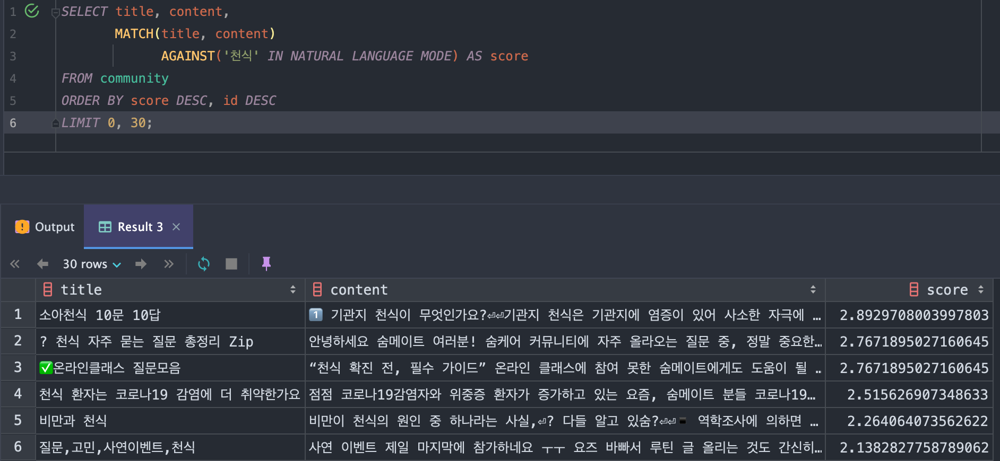

# 숨케어

## 간단 소개

### 서비스 소개 : 숨케어

> **기록, 커뮤니티 기능 및 정보 컨텐츠 제공을 통해 천식 환자의 자가 관리를 돕는 모바일 앱 서비스**

* 주요 사용 대상
  * 천식 환자 및 천식 의심 환자
  * 가입자 수 : 10K
  * MAU : 약 2200명
  * [공식 홈페이지](https://www.soomcare.com/)
  * [AOS](https://play.google.com/store/apps/details?id=com.kmw.soom2&utm_source=website&utm_medium=banner&utm_campaign=websitemainbanner), [IOS](https://apps.apple.com/kr/app/%EC%88%A8%EC%BC%80%EC%96%B4-%EC%B2%9C%EC%8B%9D%EA%B4%80%EB%A6%AC-%ED%95%84%EC%88%98%EC%95%B1/id1498028879?utm_source=website&utm_medium=banner&utm_campaign=websitemainbanner)
* 주요 기능
  * 증상 기록, 복용 기록, 폐기능 기록 등 **천식 환자에게 맞춰진 기록** 기능
  * 월별로 **기록을 한 눈에** 볼 수 있는 기능
  * 기록을 토대로 만들어진 **보고서를 볼 수 있는** 기능
  * 사용자 별로 복용 중인 약을 추가, 수정, 삭제하여 **약 관리 및 복약 알람** 기능
  * 사용자 간에 기록이나 자신의 **상태를 공유하고 댓글을 작성**할 수 있는 기능
  * 천식에 관련된 정리된 **정보 컨텐츠들을 검색 및 조회하고 열람**할 수 있는 기능

 

### 주요 업무

> **천식 관리 어플 숨케어 서비스의 모든 백앤드 시스템 구축, 관리 및 백앤드 팀 리드**

* **인하우스 프로젝트 구축** 
  * 아웃소싱 코드를 자사 코드로 이전, 클라우드 변경, CI / CD 구축
  * 기간 : 2021.11.07 ~ 2022.06.05
  * 인원 : 1명
* **데이터 무중단 마이그레이션** 
  * 기존 가비아 클라우드에 있는 데이터를 무중단 이관
  * 기간 : 2022.06.07 ~ 2022.06.25
  * 인원 : 2명
* **서버 로그 트래킹, 시스템 모니터링 기능 구축 및 알림 시스템 구축** 
  * 서버 로그, 시스템 로그 수집 / 시각화 기능 제공 및 이상 징후 메시지  푸시 기능 구축
  * 기간 : 2022.06.28 ~ 2022.09.19
  * 인원 : 1명
* **검색 플랫폼 전환 및 아키텍처 스타일 변경**
  * 기존 검색 시스템이 MySQL에서 Elasticsearch로 기술 전환
  * 기존 모놀리스로 구성된 아키텍처를 MSA로 변경
  * 기간 : 2022.09.20 ~ 2022.11.29
  * 인원 : 1명

  

## 개발 환경 / 기술

### 1. Backend

- Java, JavaScript
- Spring Boot, Spring MVC
- Spring Data JPA, QueryDSL, MyBatis
- Junit5, Mockito, Spring Rest Docs
- Gradle

### 2. Dev-Ops / Middle Ware

* AWS - ECS, ECR, ELB, Fargate, EC2, Lambda, RDS, ElastiCache, S3, CloudWatch, CloudFront, Route 53, OpenSearch
* MySQL, Redis
* Jenkins, Docker
* Nginx
* AWS OpenSearch + Filebeat

### 3. Fontend

* HTML5, CSS3(SCSS), JS(ES6)

### 4. Tools & Collaboration

* IntelliJ, VS Code, Postman
* Git, Github
* Slack, Notion

  

## 1. 인하우스 프로젝트 구축

### 1. 이슈 파악 / ToDo List

* API 서버와 Back-Office 서버가 하나의 애플리케이션으로 운영 -> ***숨케어 애플리케이션, 망 분리 / 아키텍처, 인프라 설계 / 클라우드 서비스 설정***)
* 정규화가 되어 있지 않은 데이터 모델링 -> ***데이터 모델링 재설계***
* 파악하기 힘들고 Restful 하지 못한 API 설계 및 협업하기 힘든 Rest 문서 도구 사용 -> ***Rest API 재설계 및 Spring Rest Docs로 문서화 진행***
* 서버를 수동으로 원격 접속해서 배포하는 구조  -> ***시스템 자동화 구축 ( CI / CD )***
* 부족한 기능 및 취약한 보안, 테스트 코드 부재 -> ***기능 고도화 및 보안 강화, 단위 / 통합 테스트 구현***

 

## 2. 내가 한 일

#### 1. 숨케어 애플리케이션, 망 분리 / 아키텍처, 인프라 설계 / 클라우드 서비스 설정

* ToDo List

  > 1. API 서버와 Back-Office 서버 분리 / 개발망, 운영망 분리
  > 2. 프로젝트 아키텍처 스타일 채택
  > 3. 인프라 아키텍처 설계
  > 4. AWS 서비스 자원 설정 및 구축

* 상세 설명

  1. ***API 서버와 Back-Office 서버 분리 / 개발망, 운영망 분리***

     * 분리하는 이유?
       * 기존에는 합쳐져 있어 커다란 애플리케이션은 한번에 빌드를 시키기 때문에 상당수의 시간을 허비
       * API, Back-Office 서비스는 성향이 다름
       * 복잡한 구조를 단순화 시키기 위해
       * 운영하는 서비스의 안정성 향상
       * 오염된 데이터가 들어가는 것을 방지
  
  2. ***프로젝트 아키텍처 스타일 채택 - 레이어드 아키텍처 + 멀티 모듈***
  
     * Why 레이어드 아키텍처?
       * 빠른 구현을 위해 레이어드 아키텍처를 사용
       * 기술 Base로 구성하기 때문에 구조 파악이 쉬움
     * Why 멀티 모듈?
       * 레포지토리 단위로 관리하는 경우 복잡성 증가
       * 도메인이 비슷해 중복 코드가 다수 발생
     
  3. ***인프라 아키텍처 설계***
  
     * 최종 아키텍처
        

     
     * 설명
     
       - 서버 환경 변경 fargate 채택
         - 이유 : 인프라를 직접 관리할 필요 없이 자동으로 운영 가능해 관리 효율성 향상
         - 효과 : 운영 부담 감소와 확장성 확보
       - ecr + ecs 도입
         - 이유
           - 확장성이 뛰어난 완전관리형 오케스트레이션 기술 도입
           - 쿠버네티스를 직접 구성하지 않아도 오케스트레이션 사용 가능
           - 배포 방식이 컨테이너 기반으로 변경됨 (Docker + 이미지)
           - 서버 버저닝 관리가 용이
         - 효과 : 쿠버네티스를 직접 설정할 필요 없이 ECS로 효율적 운영 가능
       - 공유 캐시 도입: ElastiCache - Redis
         - 이유 : 빠른 데이터 접근과 캐싱 성능 개선을 위해
         - 효과 : 응답 속도 개선과 데이터베이스 부하 감소
       - ALB와 Route53 연결
         - 이유 : 로드밸런서를 통해 트래픽 분산 및 고가용성 확보
         - 효과 : Route53을 사용한 안정적 DNS 관리와 서비스 연속성 보장
       - VPC 분리: 운영망과 개발망 분리
         - 이유 : 기존 운영망 접근이 용이해 보안 취약성 존재 → 운영망을 Private으로 전환하여 보호
         - 효과 : 운영망을 Private하게 구성해 외부 노출 최소화

#### 2.데이터 모델링 재설계

* ToDo List

> 1. 정규화와 역정규화를 적절히 사용해 데이터 모델링 진행
> 2. ERD 설계 및 문서화

* 상세 설명

  1. ***정규화와 역정규화를 통한 데이터 모델링***

     * 논리적으로 유사한 경우 통합 후 타입으로 구분

     * 가능한 한 정규화 적용, 복잡할 경우 역정규화
  
     * 데이터 마이그레이션 대비 부가 설명 및 기본값 설정
  
  2. ***ERD 설계 및 문서화***
  
     * 비슷한 릴레이션끼리 묶어 ERD 작성 및 문서화
  
     * 결과
  
       

  

#### 3. Rest API 재설계 및 Spring Rest Docs로 문서화 진행

* ToDo List

> 1. 자원과 행위에 맞게 Rest API를 설계
> 2. Spring Rest Docs로 API 문서 자동화 도입

* 상세 설명
  1. ***자원과 행위에 맞는 Rest API 설계***
     
     * URI로 자원을 표현하고, HTTP Method로 행위 정의
     * 명확한 Http Status Code와 보안 강화를 위한 Custom Status Code 사용 (메시지 노출 최소화)
     * 적절한 쿠키, 헤더 사용 / 비슷한 자원은 Query Parameter로 구분
     
  2. ***Spring Rest Docs로 API 문서 자동화 도입***
  
     * 문서 자동화 도구 사용한 이유?

       * Wiki나 Word 문서는 수정·삭제 시 동기화가 어려움 -> 자동화 도구는 실시간 API 문서 확인이 가능
       
     * Spring Rest Docs 사용한 이유?
     
       * Swagger는 운영 코드에 불필요한 어노테이션 추가
       * 일부 스프링 버전과 호환성 문제
       * 테스트 성공 시에만 문서 생성으로 서비스 신뢰도 향상
       
     * 결과
     
       

       
  

#### 4. 시스템 자동화 구축 ( CI / CD )

* ToDo List

> 1. 자동화 도구 선택
> 1. 시스템 자동화 설계
> 1. 상태 결과 푸시 메시지 (슬랙) 기능 구현

* 상세 설명
  
  1. ***자동화 도구 선택***
  
     * 도구 선택 기준 - 풍부한 래퍼런스(참고자료) 제공, 사용이 쉬워 빠르게 적용 가능
     * jenkins을 선택한 이유?
       * ``무료 오픈 소스`` 자동화 서버
       * 다양한 **플러그인 지원**으로 확장성 우수
       *  빌드, 테스트, 배포 등 **소프트웨어 개발 전 과정 자동화** 지원
     
  2. ***시스템 자동화 설계***
  
     * Jenkins pipeline을 이용해서 CI/CD 구축
  
       * pipeline을 사용한 이유?
         * publish over ssh 플러그인이 2022.01부로 지원이 중단
         * **연속된 작업을 연결**하는 구조로 세부 작업 구현 가능 (예: 암호화, AWS 연동)
         * **직관적인 UI**로 개발자가 사용하기 편리
     
     * 결과
     
       * 젠킨스 파이프라인 종류
     
         

     
       * 젠킨스 파이프라인 스태이지 ( Runtime Avg : ~ 8min)
     
         

     
  3. ***상태 결과 푸시 메시지 (슬랙) 기능 구현***
  
     * 슬랙 알림으로 배포 상태 전송 
  
       * Jenkins와 Slack Webhook 연동으로 배포 결과를 실시간으로 전달
  
       * 성공/실패 여부와 관련된 메시지 전송으로 즉각적인 피드백 제공
     
     * 결과
     
       

#### 5. 기능 고도화 및 보안 강화, 단위 / 통합 테스트 구현

* ToDo List

> 1. 기능 고도화 및 로그인 기능 보강
> 2. 전문 검색 제공
> 3. JUnit과 인수 테스트를 통해 서비스 신뢰성 향상

* 상세 설명

  1. ***기능 고도화 및 로그인 기능 보강***

     * 대표적인 기능 고도화
       * 쿼리 튜닝 - JPA + QueryDSL과 MyBatis를 활용하여 쿼리 최적화, Explain 키워드와 다수 데이터를 가지고 테스팅
       * 데이터 캐싱화 - 자주 요청되는 데이터 캐싱을 통해 리소스 절감
       * 시큐어리티를 이용한 보안 강화 - Spring Security와 OAuth2, JWT, 캐시를 사용한 접근 제어 및 인증 시스템 구축
         * 캐시를 사용하는 이유? 
  
           * 인증 후 JWT 토큰으로 인가 방식 채택 - 토큰 기반 사용
           * 토큰을 캐시서버에 넣고 expire 시간을 주면 RDS 네트워크 비용이 감소 할거라 판단
  
  2. ***전문 검색 제공***
  
     * nGram을 사용해 전문 검색 지원
  
       * 전문 검색을 설정한 이유와 n-gram을 사용한 이유?
         * `LIKE` 검색의 성능 문제와 정확도 저하를 해결하기 위해 MySQL n-gram 도입
         * 서비스 규모상 전문 검색 엔진 대신 MySQL n-gram 사용이 비용 효율적이라고 판단
         * 간단한 설정(2, 3-gram 파싱)으로 인덱스 스캔을 통한 빠른 검색 속도 제공
         * 다른 검색 엔진 대비 구축과 운영의 시간 및 리소스 절감
       
     * 결과
  
       

  
  3. ***JUnit과 인수 테스트를 통해 서비스 신뢰성 향상***
  
     * 서비스 안정성 향상을 위한 단위 테스트 및 인수 테스트
  
       * 테스트 목표: 70~80% 커버리지 유지
         - 단순 in-out 프로세스의 코드는 테스트가 생산성에 미치는 영향을 고려하여, 필요한 레이어에만 unit 또는 mocking 테스트 진행
     
     * 결과
     
       

     

  

## 2. 데이터 무중단 마이그레이션

### 1. 이슈 파악 / ToDo List

* 클라우드 변경으로 인해 RDB 데이터 이관 필요 -> ***데이터 손실 및 다운 타임 없이 가공된 데이터를 신규 AWS 서버로 데이터 실시간 무중단 이관 작업 진행***

 

### 2. 내가 한일

#### 1. 새로운 AWS 서버로 데이터 무중단 이관 작업 진행

* ToDo List

> 1. 데이터 마이그레이션 방법 설계 후 이관

* 상세 설명

  1. ***데이터 마이그레이션 방법 설계 후 이관***

     * 아키텍처

       

       * 설명
         * 기존 DB와 연결해 전체 데이터를 불러오는 크롤링 서버 구현
         * 크롤링 서버에 요청하는 데이터 처리 API 서버를 만들어 데이터 처리하고 새로운 RDS에 저장
         * 매일 00시 기준으로 데이터 처리 API 서버에 API를 Request 해 데이터 이관 작업 실행
         * Map 구조체, Equals & Hashcode를 활용하여 Application 단에서 중복 데이터 제거 및 오류 디버깅
         * 정적 파일은 스크립트를 사용해 이미지 샌딩 후 url 포멧팅에 맞게 S3로 이관

  

## 3. 서버 로그 트래킹, 시스템 모니터링 기능 구축 및 알림 시스템 구축

### 1. 이슈 파악 / ToDo List

* 접근성 문제와 로그 트래킹이 어려워 발생하는 데이터 손실 문제 발생 -> ***로그 수집 시스템 구축***
* 운영 리소스의 시스템 지표를 파악하기 어려움 -> ***시스템 모니터링 시각화 제공 및 알람 시스템 구축***

 

### 2. 내가 한일

#### 1. 로그 수집 시스템 구축

* ToDo List

  > 1. 로깅 시스템 구조 설계
  
* 상세 설명

  1. ***로깅 시스템 구조 설계***

     * 구조

       

       * 설명
           1. OpenSearch Cluster 구축 - 개발망과 운영망 분리
             * 형태소 분석을 할 필요가 없기 때문에 필드 타입을 keyword로 설정
             * 멀티태넌시를 지원하기 때문에 인덱스를 시계열 형태 생성하도록 설정 / 인덱스 패턴 적용
           2. Filebeat.yml 설정 - 로그 파일에서 데이터를 추출하고 가공하여 OpenSearch에 색인
             * Filebeat을 사용한 이유?
               * 마이크로서비스 환경이 아니고 로그 수집기를 서버와 함께 동작하도록 설계하여 리소스 효율을 극대화해야하기 때문에 Filebeat 사용
           3. cerebro 구축 - 운영망에서 OpenSearch 시스템을 간편하게 모니터링
           
       * filebeat 로그 추출 결과
         
           

           
       * 노드 구성도
         
           

           
       * 키바나 대시보드 및 디스커버리
       
           

  
  
  ​     

#### 2. 시스템 모니터링 시각화 제공 및 알람 시스템 구축

* ToDo List

  > 1. CloudWatch 로그 그룹을 이용한 대시보드 제공
  > 2. CloudWatch 로그 그룹을 통한 오류 메시지 전송

* 상세 설명

  1. ***클라우드 워치 로그 그룹을 이용해 대시보드로 제공***

     * CloudWatch 대시보드를 사용해 운영되고 있는 서비스들을 모니터링 할 수 있도록 설정

       * CloudWatch 사용 이유 - AWS에서 수집한 데이터로 충분한 모니터링 효과를 얻을 수 있으며, 포괄적인 시스템 로그 지원

     * 시스템 로그 관리 결과
  
       

  
     * 대시보드
  
       

  
  2. ***CloudWatch 로그 그룹을 통한 오류 메시지 전송***
  
     * 시스템 부하 시 오류 메시지를 사내메신저로 전송하도록 Lambda 코드를 구현
  
     * 아키텍처
  
       
  
       

       
     * 설명
  
       * 시스템 부하 발생 시 CloudWatch에 로그가 생성되면, 해당 로그가 Lambda로 전송
       * Lambda는 로그를 추출하고 변환하여 슬랙에 메시지를 전송
       * 알람 종류 - Slow Query, CPU, Memory, Request Count
  
     * 결과
  
       

  

## 4. 검색 플랫폼 전환 및 아키텍처 스타일 변경

### 1. 이슈 파악 / ToDo List

* 기존 MySQL n-gram 검색 방식의 부정확한 score 계산과 RDB에 집중된 구조 문제 -> ***Elasticsearch 전문 검색으로 변경***
* 모놀리식 프로젝트 구성의 유지 보수 시간이 길어지고 복잡성이 증가 -> ***MSA 아키텍처 스타일로 변경***

 

### 2. 내가 한일

#### 1. Elasticsearch 전문 검색으로 변경

* ToDo List

  > 1. 인덱스 매핑 정보 설정 / 토크나이저, 어놀라이저 적용 
  > 2. 기존 RDS에 있는 데이터 이관 파이프라인 구축

* 상세 설명

  1. ***인덱스 매핑 정보 설정 / 토크나이저, 어놀라이저 적용***

     * 사용자, 커뮤니티, 기록 검색 등 필요한 영역에 인덱스를 생성하고 매핑 정보를 설정
     
  2. ***기존 RDS에 있는 데이터 이관 파이프라인 구축***
  
     * 검색할 데이터를 RDB에서 Elasticsearch로 저장하는 파이프라인을 구축
  
     * 아키텍처
  
       

  
     * 설명
     
       * RDS의 데이터를 MSK로 이벤트 발생 시킨후  rollup 어플리케이션으로 컨슘 후 opensearch에 색인
       * 실시간 검색 정보 제공

#### 2. MSA 아키텍처 스타일로 변경

* ToDo List

  > 1. 이벤트 스토밍

* 상세 설명

  1. ***이벤트 스토밍***

     * API를 세분화 진행 - ***이벤트 스토밍 진행*** 

     * 도메인 이벤트 도출 -> 외부 시스템 연동 연결 -> 커맨드 입력 -> 액터와, 애그러거트 설정 -> 핫스폿으로 생각할 부분 정리 -> 바운드디 컨텍스트 분리 -> 분리된 컨텍스트들을 이벤트 발생시 어떻게 할지 매핑

     * 결과
     
       

