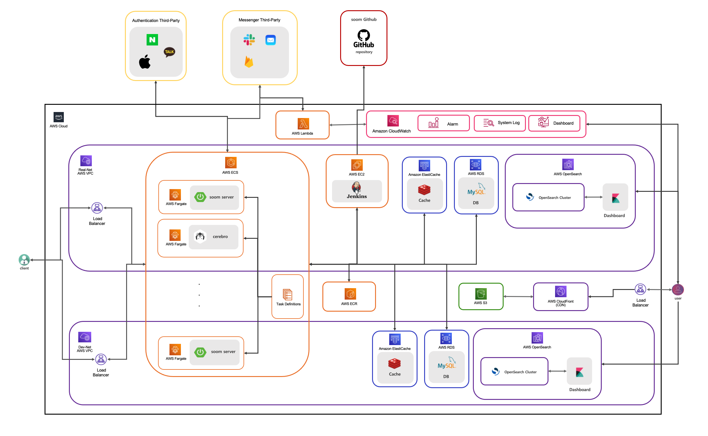

# 숨케어

## 간단 소개

### 서비스 소개 : 숨케어

> **기록, 커뮤니티 기능 및 정보 컨텐츠 제공을 통해 천식 환자의 자가 관리를 돕는 모바일 앱 서비스**

* 주요 사용 대상
  * 천식 환자 및 천식 의심 환자
  * 가입자 수 : 10K
  * MAU : 약 2200명
  * [공식 홈페이지](https://www.soomcare.com/)
  * [AOS](https://play.google.com/store/apps/details?id=com.kmw.soom2&utm_source=website&utm_medium=banner&utm_campaign=websitemainbanner), [IOS](https://apps.apple.com/kr/app/%EC%88%A8%EC%BC%80%EC%96%B4-%EC%B2%9C%EC%8B%9D%EA%B4%80%EB%A6%AC-%ED%95%84%EC%88%98%EC%95%B1/id1498028879?utm_source=website&utm_medium=banner&utm_campaign=websitemainbanner)
* 주요 기능
  * 증상 기록, 복용 기록, 폐기능 기록 등 **천식 환자에게 맞춰진 기록** 기능
  * 월별로 **기록을 한 눈에** 볼 수 있는 기능
  * 기록을 토대로 만들어진 **보고서를 볼 수 있는** 기능
  * 사용자 별로 복용 중인 약을 추가, 수정, 삭제하여 **약 관리 및 복약 알람** 기능
  * 사용자 간에 기록이나 자신의 **상태를 공유하고 댓글을 작성**할 수 있는 기능
  * 천식에 관련된 정리된 **정보 컨텐츠들을 검색 및 조회하고 열람**할 수 있는 기능

 

### 주요 업무

> **천식 관리 어플 숨케어 서비스의 모든 백앤드 시스템 구축, 관리 및 백앤드 팀 리드**

* **인하우스 프로젝트 구축** 
  * 아웃소싱 코드를 자사 코드로 이전, 클라우드 변경, CI / CD 구축
  * 기간 : 2021.11.07 ~ 2022.06.05
  * 인원 : 1명
* **데이터 무중단 마이그레이션** 
  * 기존 가비아 클라우드에 있는 데이터를 무중단 이관
  * 기간 : 2022.06.07 ~ 2022.06.25
  * 인원 : 2명
* **서버 로그 트래킹, 시스템 모니터링 기능 구축 및 알림 시스템 구축** 
  * 서버 로그, 시스템 로그 수집 / 시각화 기능 제공 및 이상 징후 메시지  푸시 기능 구축
  * 기간 : 2022.06.28 ~ 2022.09.19
  * 인원 : 1명
* **검색 플랫폼 전환 및 아키텍처 스타일 변경**
  * 기존 검색 시스템이 MySQL에서 Elasticsearch로 기술 전환
  * 기존 모놀리스로 구성된 아키텍처를 MSA로 변경
  * 기간 : 2022.09.20 ~ 2022.11.29
  * 인원 : 1명

  

## 개발 환경 / 기술

### 1. Backend

- Java, JavaScript
- Spring Boot, Spring MVC
- Spring Data JPA, QueryDSL, MyBatis
- Junit5, Mockito, Spring Rest Docs
- Gradle

### 2. Dev-Ops / Middle Ware

* AWS - ECS, ECR, ELB, Fargate, EC2, Lambda, RDS, ElastiCache, S3, CloudWatch, CloudFront, Route 53, OpenSearch
* MySQL, Redis
* Jenkins, Docker
* Nginx
* AWS OpenSearch + Filebeat

### 3. Fontend

* HTML5, CSS3(SCSS), JS(ES6)

### 4. Tools & Collaboration

* IntelliJ, VS Code, Postman
* Git, Github
* Slack, Notion

  

## 1. 인하우스 프로젝트 구축

### 1. 이슈 파악 / ToDo List

* API 서버와 Back-Office 서버가 하나의 애플리케이션으로 운영 -> ***숨케어 애플리케이션, 망 분리 / 아키텍처, 인프라 설계 / 클라우드 서비스 설정***
  * 오래 걸리는 빌드 및 런타임
  * Complexity한 구조
  * 개발 서버 부재에 따른 데이터 오염 ( 테스트 데이터 등 )
* 정규화가 되어 있지 않은 데이터 모델링 -> ***데이터 모델링 재설계***
  * 중복 데이터 다수 존재
  * 데이터 동기화 이슈
* 파악하기 힘들고 Restful 하지 못한 API 설계 및 협업하기 힘든 Rest 문서 도구 사용 -> ***Rest API 재설계 및 Spring Rest Docs로 문서화 진행***
  * 전혀 Restful 하지 못한 API ( 잘못된 자원 이름 + 단일 Http Method 사용 )
  * 마이너한 협업 도구 사용으로 사용성 저하 / 부족한 공유
* 서버를 수동으로 원격 접속해서 배포하는 구조  -> ***시스템 자동화 구축 ( CI / CD )***
  * 코드 검증 및 오래걸리는 빌드 시간으로 인해 개발 생산성 저하
  * Manual Point로 인한 오류 발생 우려
  * Scale Out 하기 어려운 구조
* 부족한 기능 및 취약한 보안, 테스트 코드 부재 -> ***기능 고도화 및 보안 강화, 단위 / 통합 테스트 구현***
  * 암호화 등 보안에 관련된 설정 부재로 인한 시스템 신뢰성 저하
  * RDB의 like 검색, 토큰 방식의 전체 푸쉬 등 low한 Performance 기술 사용
  * 테스트 코드가 없어 신뢰성 및 안정성 하락

 

### 2. 내가 한 일

#### 1. 숨케어 애플리케이션, 망 분리 / 아키텍처, 인프라 설계 / 클라우드 서비스 설정

* ToDo List

  > 1. API 서버와 Back-Office 서버 분리 / 개발망, 운영망 분리
  > 2. 프로젝트 아키텍처 스타일 채택
  > 3. 인프라 아키텍처 설계
  > 4. AWS 서비스 자원 설정 및 구축

* 상세 설명

  1. ***API 서버와 Back-Office 서버 분리 / 개발망, 운영망 분리***

     * 분리하는 이유?

       * 기존에는 합쳐져 있어 커다란 애플리케이션은 한번에 빌드를 시키기 때문에 상당수의 시간을 허비
       * API, Back-Office 서비스는 성향이 다름
       * 복잡한 구조를 단순화 시키기 위해

       * 운영하는 서비스의 안정성 향상
       * 오염된 데이터가 들어가는 것을 방지
  
  2. ***프로젝트 아키텍처 스타일 채택 - 레이어드 아키텍처 + 멀티 모듈***
  
     * Why 레이어드 아키텍처?
  
       * 빠른 구현을 위해 레이어드 아키텍처를 사용
  
       * 기술 Base로 구성하기 때문에 구조 파악이 쉬움
     * Why 멀티 모듈? 
     
       * 레포지토리 단위로 관리하는 경우 복잡성 증가
     
       * 도메인이 비슷해 중복 코드가 다수 발생
     
  3. ***인프라 아키텍처 설계***
  
     * 설계 중점 포인트
     
       * 망 운영 방식
       * 서버 분리에 따른 로드 밸런싱
       * 정적 파일 관리
       * CI / CD 구조 정립
     
     * 방대한 양의 서비스이기 때문에 처음 틀은 러프하게 구성하고 점차 발전하는 방식으로 진행
     
     * 1차 ~ 4차 아키텍처
     
       * 1차 프로토 타입
     
         

     
         * 설명
           * 단일 vpc 안에 API, Back-Office 서버를 분리하는 구조로 진행
           * 단일 스토리지와 RDB가 서버와 통신
         * 부족한점 / 아쉬운점
           * 단일망으로 인한 보안 이슈 및 데이터 오염
           * SPOF 지점 다수 존재
     
        * 2차 프로토 타입
     
           

     
           * 설명
             * 단일 vpc 안에 운영 서버와 개발 서버 분리
             * 스토리지와 RDB 운영, 개발로 분리 후 각 서버에 연결
             * Multi-AZ를 통해 수동 개입 없이 자동으로 장애 조치 가능
             * 이로써 운영은 Client 만 접근이 가능하게 만들고, 개발은 개발자가 접근 할 수 있도록 구성
           * 부족한점 / 아쉬운점
             * 불가능한 무중단 배포
             * 수동으로 해야하는 배포 작업
             * 부족한 이중화
     
        * 3차 프로토 타입
     
           

     
           * 설명
             * 무중단 배포와 자동화를 위해 젠킨슨 Tool 도입 ( CI / CD )
             * jenkins - publish over ssh와 shell script로 지속적인 통합 및 배포 실행
             * 전면 이중화 진행 ( 개발망 일부 제외 )
           * 부족한점 / 아쉬운점
             * 앞단에서 따로 접근해야 하는 주소 ( load balance x )
             * 서버 스팩을 직접 설정하는 문제 ( auto scaling x )
             * 로컬 캐싱으로 인한 데이터 동기화 문제
             * publish over ssh 플러그인 지원 종료로 인한 문제 ( xss, 암호화등 취약점 발생 )
       
        * 4차 아키텍처 모델
       
           

       
           * 설명
             * 서버 환경 변경 : ec2 -> fargate
             * ecr + ecs 도입
             * 젠킨슨 플러그인 변경 : publish over ssh -> pipeline
             * 공유 캐시 (elasticache - redis) 도입
             * alb를 사용으로 로드밸런싱 및 route53으로 DNS 연결
             * vpc 분리 ( 운영, 개발 )
       
     * 최종 아키텍처에서 서버 환경을(ec2 -> fargate) 변경한 이유?
     
       * 기본 인프라 관리를 안해도 되기 때문에 ( 관리 효율 향상 )
       * 또한 좀 더 편하게 운영 관리 하기 위해 위와 같이 아키텍처 구성
     
     * 최종 아키텍처에서 서비스 운영 환경을 컨테이너 + 클러스터로(ecr + ecs) 변경한 이유?
     
       * 확장성이 강한 완전관리형 컨테이너 오케스트레이션 기술을 채택
       * 또한 쿠버네티스를 직접 구성안해도 오케스트레이션 환경 사용 가능
       * 배포 방식 변경으로 인해 컨테이너 기술을 사용 해야해서 ( docker + images )
       * 서버 버저닝 관리가 편리함
     
     * 최종 아키텍처에서 망을(vpc) 분리한 이유?
     
       * security group의 세분화
       * 운영망 접근이 쉬워 보안에 취약 -> 운영망을 private하게 변경
     

#### 2.데이터 모델링 재설계

* ToDo List

> 1. 정규화와 역정규화를 적절히 사용해 데이터 모델링 진행
> 2. ERD 설계 및 문서화

* 상세 설명

  1. ***정규화와 역정규화를 적절히 사용해 데이터 모델링 진행***

     * 논리적인 명칭은 다르지만 비슷한 경우 통합 후 타입으로 구분

     * 정규화를 최대한 적용시키고 복잡할 경우 역정규화
     * 추후 데이터 마이그레이션 작업을 위해 부가 설명 및 default 값 정의

  2. ***ERD 설계 및 문서화***

     * 문서화 도구 : ERD Cloud 사용

     * ERD 구성뒤 서로 비슷한 릴레이션끼리 묶고 문서화 진행

     * 결과

       

       

#### 3. Rest API 재설계 및 Spring Rest Docs로 문서화 진행

* ToDo List

> 1. 자원과 행위에 맞게 Rest API를 설계
> 2. Spring Rest Docs로 API 문서 자동화 도입

* 상세 설명
  1. ***자원과 행위에 맞게 Rest API 설계***
     * Rest API 디자인 가이드에 따름
     * URI는 자원으르 표현하고 자원에 대한 행위는 HTTP Method 활용
     * 명확한 Http Status Code와 Custom Status Code로 응답
       * Custom Status Code를 내보는 이유? 
         * 메시지기 노출 되는 순간 보안에 취약할 것이라 판단
     * 적절한 쿠키, 헤더 사용
     * 비슷한 자원을 요청할 때 Query Parameter로 구분
  2. ***Spring Rest Docs로 API 문서 자동화 도입***

     * Wht Docs Automation Tool?
  
       * 기본 wiki나 words등을 사용하는 경우, 문서의 동기화가 어려움 ( 수정이나 삭제시 개발자가 직접 들어가서 작성해야 하고 다른 개발자는 최신 문서인지 확인해봐야 함 )
       * 문서 자동화 도구는 실시간으로 API 문서 확인이 가능하기 때문에 API 문서 자동화 도구 도입
  
     * Why Spring Rest Docs?
  
       * API 문서의 목적은 개발하는 스펙을 정의하는것이라 생각
       * Swagger는 직접 운영 코드에 어노테이션을 사용하는 형태
       * 이는 운영 코드에 필요 없는 코드가 들어간다고 판단
       * 또한 Swagger는 스프링 일부 버전에 호환이 안되는 문제가 있음
       * **그리고 Spring Rest Docs를 사용한 결정적인 이유는 테스트가 성공해야 문서가 작성되기 때문에 서비스의 신뢰성이 높아진다고 판단**
  
     * 결과
  
       

       
  

#### 4. 시스템 자동화 구축 ( CI / CD )

* ToDo List

> 1. 자동화 도구 선택
> 1. 시스템 자동화 설계
> 1. 상태 결과 푸시 메시지 (슬랙) 기능 구현

* 상세 설명
  
  1. ***자동화 도구 선택***
  
     * 도구 선택 기준
       1. 래퍼런스가 풍부한 도구
       2. 다루기 쉬운 도구
     * jenkins을 선택한 이유?
       * ``무료 오픈 소스`` 자동화 서버
       * 수많은 플러그인 지원
       *  빌드, 테스트, 배포와 관련된 소프트웨어 개발 부분을 자동화
  
  2. ***시스템 자동화 설계***
  
     * 초기 publish over ssh 플러그인과 shell script을 사용해 CI / CD 구축
  
       * publish over ssh를 사용한 이유?
         * 간단한 설정으로 쉽게 배포가 가능했기 때문에
       * git code를 pulling한 뒤 build 후 각 서버에 jar 파일 전송후 shell script으로 서버 실행
       * shell script 프로세스
         * 8080, 8081서버 health checking
         * 체킹이 안된 서버를 새로운 서버로 실행
         * nginx로 80:(새로운 서버 포트) 연결
  
     * 현재 pipeline을 사용해서 CI / CD 구축 완료
  
       * publish over ssh에서 pipeline으로 변경한 이유?
  
         * 기존 publish over ssh 플러그인이 2022.01부로 지원이 중단되기 때문에 변경
         * 또한 파이프라인 플러그인은 연속된 작업을 연결해 놓은 구조로 좀 더 상세한 작업이 가능 (암호화, aws 연동 등)
         * 마지막으로 직관적이라 개발자가 보기 편함
  
       * 결과
  
         * 젠킨스 파이프라인 종류
  
           

  
         * 젠킨스 파이프라인 스태이지 ( Runtime Avg : ~ 8min)
  
           

  
  3. ***상태 결과 푸시 메시지 (슬랙) 기능 구현***
  
     * 슬랙 알림으로 배포 상태 전송
  
     * 빌드 및 AWS 배포 소요시간 볼 수 있도록 구성
  
     * 결과
       
       

#### 5. 기능 고도화 및 보안 강화, 단위 / 통합 테스트 구현

* ToDo List

> 1. 기능 고도화 및 로그인 기능 보강
> 2. 전문 검색 제공
> 3. JUnit과 인수 테스트를 통해 서비스 신뢰성 향상

* 상세 설명

  1. ***기능 고도화 및 로그인 기능 보강***

     * 정적 파일 등록 / 삭제 기능 고도화 (확장자 필터링, 이름 패턴 등)
  
     * 쿼리 튜닝
  
       * JPA와 Mybatis를 적절히 섞어 쿼리 튜닝 진행
       * 기본적인 쿼리는 JPA + queryDSL 복잡한 쿼리는 mybatis로 해결
       * explain 키워드와 다수 데이터를 가지고 테스팅
  
     * 자주 요청하는 데이터 캐싱화 진행 -> 리소스 비용 절감
  
     * 슬랙, 이메일 <-> 애플리케이션, CI / CD 서버 연동
  
       * 왜?
         * 팀원들에게 빠르게 업무 진행 상황을 공유
         * 사용하는 메신저와 연동함으로써 접근성이 쉬움
  
     * 스프링 시큐어리티를 사용해 보안 시스템 구축
  
       * 역할 별로 접근 가능한 경로 설정
       * 필터로 인가 되지 않은 유저 통제
       * 개인 정보 단방향 암호화
  
     * OAuth2 + JWT + Cache를 이용해 기존 로그인 기능 보강
  
       * 왜? 
  
         * 기존 단순 개인 정보만(이메일, 비밀번호, sns-id 등) 맞으면 인증 / 인가 되도록 설계
         * 따라서 이메일, SNS 로그인 방식 분리
  
       * 어떻게?
  
         * 인증 후 JWT 토큰으로 인가 방식 채택
  
         * 인가된 사용자를 Redis 캐시에 저장시키는 구조로 설계해 몰려드는 RDS 네트워크 비용 절감
  
         * 설명
  
           * 이메일 방식
  
             

  
           * SNS 방식
  
             

  
  2. ***전문 검색 제공***
  
     * nGram을 사용해 전문 검색 지원
  
       * Why 전문검색 지원?
         * 기존 like 검색으로 인해 성능 이슈 발생
         * 또한 조사가 포함되면 검색 정확도가 떨어짐 (부정확함)
       * Why nGram?
         * 간단한 설정으로 사용이 가능 (2, 3-gram으로 파싱)
         * 인덱스 스캔이라 속도가 빠름
         * 다른 전문 검색 엔진을 사용하려면 클러스터 구축부터 비지니스 구현까지 시간이 오래 걸림
  
     * 결과
  
       

  
  3. ***JUnit과 인수 테스트를 통해 서비스 신뢰성 향상***
  
     * 단위 테스트와와 인수 테스트로 서비스 안정성 향상
  
     * 테스트 목표 : 커버리지 70 ~ 80%
  
       * 70 ~ 80% 유지하는 이유?
         * 단순 in-out 프로세스를 가진 코드는 테스트는 생산성에 영향을 준다고 생각
         * 따라서 위 기준을 토대로 테스트가 필요한 레이어에서 unit 혹은 mocking 테스트 진행
  
     * 결과
  
       

       

 

### 3. 느낀 점 (3L)

#### 1. 좋았던 점 (Like)

* **프로젝트 처음부터 끝에 대한 경험** - 설계부터 운영까지 스스로 책임지고 구현해 성과를 냈던 경험이 좋았음
* **다양한 기술 공부** - 기술을 광범위하게 배우고자 했던 노력이 좋았음
* **개발 문화 체계화** - 팀원과 함께 개발 문화를 만들어갔던 것이 좋았음

#### 2. 아쉬운점 (Leak)

* **부족한 개발 시간** - 시간 부족으로 인해 기술적으로 적용 못시킨 부분이 아쉬움
* **복잡한 테이블 참조 구조** - 다양한 테이블끼리 직접 참조로 인해 릴레이션 파악이 어려움
* **API 세분화 이슈** - 비슷하게 요청하는 자원 분리 부족
* **기능 부족** - 부족한 로깅 트래킹, 부하 테스트 등

#### 3. 배운점 (Learn)

* **실무를 하면서 다양한 경험** - 서비스 오류 대처, 배포와 관련된 이슈 해결 등
* **다양한 직무와의 협업** -  팀원과의 긴밀한 소통
* **다른 분야의 개발 생태계 파악** - 앱 개발에 있어 동작하는 과정이라든지 등 다양한 것들을 배움

  

## 2. 데이터 무중단 마이그레이션

### 1. 이슈 파악 / ToDo List

* 클라우드 변경으로 인해 RDB 데이터 이관 필요 -> ***새로운 AWS 서버로 데이터 무중단 이관 작업 진행***
  * 이관하는 도중 서버의 다운 타임이 발생하여 데이터 손실 예방
  * DB 릴레이션 변경으로 인한 데이터 가공 필요
  * 데이터 이관 작업 중 쌓이는 데이터 처리

 

### 2. 내가 한일

#### 1. 새로운 AWS 서버로 데이터 무중단 이관 작업 진행

* ToDo List

> 1. 데이터 마이그레이션 방법 설계 및 이관
> 2. 정적 파일 새로운 클라우드에 이관

* 상세 설명

  1. ***데이터 마이그레이션 방법 설계 및 이관***

     * 설계 방법

       1. 스프링 배치와 쿼츠를 사용해서 데이터 마이그레이션 진행

          

          * 설명
            1. 기존 사용되고 있는 DB를 연결하고 전체 데이터를 불러오는 API 서버 구현 (크롤링 서버)
            2. 새로 만든 서버에 데이터를 요청하고 전처리 작업하여 RDB에 색인하는 배치잡 구현
            3. 데이터 동기화를 위해 쿼츠로 크론잡 실시 (매일 자정에 실시)
          * 단점
            * 서버를 2개 구축해야하기 때문에 시간 부족이라는 문제 발생

       2. 쿼리로 데이터 이관

          

          * 설명
            1. 쿼리로 데이터 변형시켜 export 후 새로운 RDS 서버로 import
            2. 데이터 동기화를 위해 수동으로 일정 시간마다 위 작업을 진행
          * 단점
            * 매일 쿼리를 수동으로 고쳐야 하고 관리를 해야한다는 문제 발생

     * 설계 확정 (1~2번 절충안)

       

       * 설명
         1. 기존 사용되고 있는 DB를 연결하고 전체 데이터를 불러오는 API 서버 구현 (크롤링 서버)
         2. 크롤링 서버에 요청하는 데이터 처리 API 서버를 만들어 데이터 처리하고 새로운 RDS에 저장
         3. 매일 00시 기준으로 데이터 처리 API 서버에 API를 Request 해 데이터 이관 작업 실행

     * Map 구조체, Equals & Hashcode를 활용하여 Application 단에서 중복 데이터 제거 및 오류 디버깅

  2. ***정적 파일 새로운 클라우드에 이관***

     * 방법
       1. 기존 서버는 서버 내에서 정적 파일 관리
       2. 따라서 원격 복사 명령어와 regex를 이용해 로컬에 이동 (scp)
       3. 그리고 데이터 프로세스 API에서 정적파일이 필요로 하면 로컬에 있는 파일을 읽은 뒤 이름을 형식에 맞게 변경하고   S3에 업로드

 

### 3. 느낀 점 (3L)

#### 1. 좋았던 점 (Like)

* **데이터 마이그레이션 경험** - 데이터 이관 작업을 어떻게 가져가야하는지 알 수 있었던 경험이 좋았음

#### 2. 아쉬운점 (Leak)

* **부족한 설계** - 스토리지 기반 마이그레이션이 아닌 클라우드 기반 마이그레이션이다 보니 위와 같이 하는 방법이 올바른 방법인지 잘 모르겠고 부족한 부분이 있었던 것 같음

#### 3. 배운점 (Learn)

* **다양한 방법의 마이그레이션 종류** - 마이그레이션도 다양한 방법들이 있다는 것을 배움

  

## 3. 서버 로그 트래킹, 시스템 모니터링 기능 구축 및 알림 시스템 구축

### 1. 이슈 파악 / ToDo List

* 서버 로그 파악의 어려움 -> ***로그 수집 시스템 구축***
  * 서버 내에 로그 파일 생성되는 구조 -> 접근성 불편
  * 데이터 로깅 시스템 부재 -> 올바른 데이터 분석 x
  * 시간이 지날수록 필요한 데이터 손실 증가
* 운영 시스템 수치 파악의 어려움 -> ***시스템 모니터링 시각화 제공 및 알람 시스템 구축***
  * AWS에서 사용하고 있는 서비스의 리소스들을 쉽게 파악 x
  * 운영 서비스의 시스템 오류시 신속한 파악 불가

 

### 2. 내가 한일

#### 1. 로그 수집 시스템 구축

* ToDo List

  > 1. 로그 스토리지, 수집 도구 자료 수집, 기술 채택
  > 2. 로깅 시스템 구조 설계
  > 3. 로그 데이터 수집 정보 구상
  > 4. 서버에서 수집한 로그를 키바나 디스커버리로 제공

* 상세 설명

  1. ***로그 스토리지, 수집 도구 자료 수집, 기술 채택***

     * 다양한 스토리지, 수집 래퍼런스 체크 후 ELK 채택

       * 비교 표

         | 솔루션 | AWS OpenSearch (선택)                                        | ELK (ElasticSearch + Logstash + Kibana)                      | PLG(Promtail + Loki + Grafana)                               | Splunk                                                       |
         | ------ | ------------------------------------------------------------ | ------------------------------------------------------------ | ------------------------------------------------------------ | ------------------------------------------------------------ |
         | 장점   | 1. Elasticseach를 기반한 AWS 서비스 2. 낮은 구축 비용 3. 좋은 검색 성능 및 분석 기능 | 1. 대중적인 로그 수집 솔류션 2. 다수의 래퍼런스 존재 3. 좋은 검색 성능 및 분석 기능 | 1. 쿠버네티스 생태계와 친화적 2. 로그 장기 저장 가능 3. 가벼운 설치와 높은 가성비  4. 적은 리소스 사용률  | 1. 우수한 인터페이스 제공 2. 낮은 구축 비용             |
         | 단점   | 1. 라이센스 변경으로 인한 버전 문제 2. 적은 래퍼런스 3. 큰 리소스 사용률 4. 유료 솔루션 | 1. 로그 장기 저장 불가능 2. 높은 구축 비용 3. 리소스 사용률 | 1. 복잡한 로그 수집에 맞지 않는 솔루션 2.적은 래퍼런스 3. 높은 초기 구축 비용 | 1. spl 언어를 알아야 하는 솔루션 2. 큰 리소스 사용률 3. 유료 솔루션 |

       * AWS OpenSearch 사용한 이유?
         * 클러스터 초기 구축 비용이 적음
         * 초기 요구사항에서 ELK를 전문적으로 필요로 한 요구사항이 없음
         * 사용 경험이 있어 빠르게 구축 용이
       * 위와 같은 이유로 AWS OpenSearch를 채택

  2. ***로깅 시스템 구조 설계***

     * 구조

       

       * 설명
      1. Opensearch Cluster 구축 - 개발망과 운영망 분리
         2. DockerFile 이미지 우분트로 변경 - application, filebeat 동시 운영
         3. filebeat.yml 설정 - log 파일의 데이터 추출 및 가공 and OpenSearch에 색인
         4. cerebro 구축 - 간단하게 OpenSearch 시스템 모니터링 가능 (운영망)
     
     * logstash나 fluentd가 아닌 filebeat을 사용한 이유?

       1. 마이크로 서비스 환경 x -> fluentd와 적합하지 않음
    2. 로그 수집기를 서버와 같이 동작하도록 설계했기 때문에 리소스 효율이 좋아야함 -> 리소스가 많이 드는 logstash가 적합하지 않음
       3. input, output이 간단함 -> filebeat 사용
  
     * filebeat 로그 추출 결과

       

  3. ***로그 데이터 수집 정보 구상***

     * OpenSearch 클러스터 환경 구축

       * 개발망, 운영망 분리

       * 노드 구성

         * 마스터 노드 3개, 데이터 노드 4개

           * 마스터 노드를 위와 같이 구성한 이유? -> 스플릿 브레인을 방지하기 위해

         * 결과

           

     * 로그 인덱스 매핑 정보, 인덱스 설정

       * 형태소 분석을 할 필요가 없기 때문에 필드 타입을 keyword로 설정
       * 멀티태넌시를 지원하기 때문에 인덱스를 시계열 형태 생성하도록 설정 / 인덱스 패턴 적용
  
  4. ***서버에서 수집한 로그를 키바나 디스커버리로 제공***

     * 결과

       

#### 2. 시스템 모니터링 시각화 제공 및 알람 시스템 구축

* ToDo List

  > 1. 클라우드 워치 로그 그룹을 이용해 대시보드로 제공
  > 2. 클라우드 워치 로그 그룹을 이용해 시스템 부하시 오류 메시지를 보내도록 람다 코드 구현

* 상세 설명

  1. ***클라우드 워치 로그 그룹을 이용해 대시보드로 제공***

     * CloudWatch 대시보드를 사용해 운영되고 있는 서비스들 모니터링

     * Why CloudWatch?

       * 수집해서 보여줄 데이터를 cloudwatch만으로도 해결 (cpu, memory, request, read write byte 등)
       * 포괄적인 시스템 로그 지원 (cluster, rds, elasticache, opensearch 등)
       * 구현 비용 절감
       * 추후 보다 정밀한 모니터링을 시각화 해야하는 경우 다른 플랫폼을 사용 예정 ( Promethus + grafana등 )

     * 따라서 모든 AWS 서비스에 로그 설정 후 로그 데이터로 대시보드 생성

     * 결과

       * 시스템 로그 관리

         

       * 대시보드

         

  2. ***클라우드 워치 로그 그룹을 이용해 시스템 부하시 오류 메시지를 보내도록 람다 구현***

     * 람다를 이용해 슬로우 쿼리 및 cpu, memory 부하시 슬랙으로 알람 전송 기능 구현

     * 구조 설계

       

       * 설명
         * 시스템 부하시 클라우드 워치에 로그 생성 후 람다에게 로그 전송
         * 람다에서 로그를 추출 및 변환시키고 슬랙에 메시지 전송

     * 알람 종류 - Slow Query, CPU, Memory, Request Count

     * 결과

       

 

### 3. 느낀 점 (3L)

#### 1. 좋았던 점 (Like)

* **향상된 안정성과 신뢰성** - 로그 모니터링 시스템으로 오류를 보다 신속하게 처리할 수 있어 높은 사용자 경험을 제공하는 것이 좋았음
* **로그 수집 생태계 경험** - 로그 모니터링 시스템 구축을 경험했던 것이 좋았음
* **편리한 기능 제공** - 팀원들에게 향상된 및 편리한 기능을 제공한 것이 좋았음

#### 2. 아쉬운점 (Leak)

* **새로운 기술을 적용한 설계 x** - fluentd, MQ, LPG 등
* **대용량 트래픽 위한 설계 x** - 대용량 트래픽을 감당하기 어려운 구조로 설계
* **fail over을 위한 설계 x** - 시스템이 다운 타임 발생시데이터 유실에 대한 대처가 부실
* **고도화 된 분석 데이터** - 기본적인 데이터만 추출 / 가공해서 색인시키기 때문에 전문성 부족

#### 3. 배운점 (Learn)

* **오픈소스 라이센스** - Elasticsearch 와 Opensearch에 라이센스 문제로 인해 해결 및 대처 혹은 활용 등을 배움 ( 버전 문제, 추후 각 솔루션마다 기술 발전 가능성 등 )
* **다양한 로그 시스템 기술에 대한 학습** - 로그 관련 시스템도 다양한 방법들이 있다는 것을 배움

  

## 4. 검색 플랫폼 전환 및 아키텍처 스타일 변경 -> 진행 도중 퇴사

### 1. 이슈 파악 / ToDo List

* 기존 MySQL ngram 검색 방식 문제 -> ***Elasticsearch 전문 검색으로 변경***
  * like보다 좋지만 부정확한 score 계산
  * RDB에 집중 되어 있는 구조 ( 부적절한 자원 분배 및 집중되어지는 트래픽 )
* 모놀로식 프로젝트 구성으로 인한 문제 -> ***MSA 아키텍처 스타일로 변경***
  * 길어지는 유지 보수 시간
  * 점점 파악하기 힘든 프로젝트 구조

 

### 2. 내가 한일

#### 1. Elasticsearch 전문 검색으로 변경

* ToDo List

  > 1. 인덱스 매핑 정보 설정 / 토크나이저, 어놀라이저 적용 
  > 2. 기존 RDS에 있는 데이터 이관 파이프라인 구축

* 상세 설명

  1. ***인덱스 매핑 정보 설정 / 토크나이저, 어놀라이저 적용***

     * 유저, 커뮤니티, 기록 검색 등 필요한 곳에 인덱스 생성, 매핑 정보 설정
     * 토크나이저, 형태소 분석, analyzer 적용 -> 전문 검색화 진행

  2. ***기존 RDS에 있는 데이터 이관 파이프라인 구축***

     * 어떻게?

       * 검색시킬 데이터들을 RDB, ElasticSeach 저장하는 파이프라인 구축

     * 구조

       

     * MSA 변경 작업과 함께 진행 예정

#### 2. MSA 아키텍처 스타일로 변경

* ToDo List

  > 1. 이벤트 스토밍

* 상세 설명

  1. ***이벤트 스토밍***

     * API를 세분화 진행 -> ***이벤트 스토밍 진행*** 

     * 진행 방법

       * 도메인 이벤트 도출
       * 외부 시스템 연동 연결
       * 커맨드 입력
       * 액터와, 애그러거트 설정
       * 핫스폿으로 생각할 부분 정리
       * 바운드디 컨텍스트 분리
       * 분리된 컨텍스트들을 이벤트 발생시 어떻게 할지 매핑

     * 결과

       

 

### 3. 느낀 점 (3L)

#### 1. 좋았던 점 (Like)

* **MSA의 이해** - 직접 구축해보지 못했지만 이벤트 스토밍 등 초기 구축 단계를 경험할 수 있어서 좋았음

#### 2. 아쉬운점 (Leak)

* **MSA 미완성** - 구축 초기 단계에서 예기치 못한 퇴사로 인한 것에 대해 아쉬움
* **검색 플랫폼 변경 x** - 비동기 통신 인프라 구축을 못해 검색 플랫폼 변경 하지 못한것에 대한 아쉬움

#### 3. 배운점 (Learn)

* **MSA 관련 기술** - API Gateway, 통신 관련 기술, 트랜잭션 관리, MSA 설계 방법 등 다양한 기술을 알 수 있었음
* **검색 데이터 분석 방법** - 토크나이져, 어놀라이져 등 분석에 관련한 다양한 방법들을 배울 수 있었음
